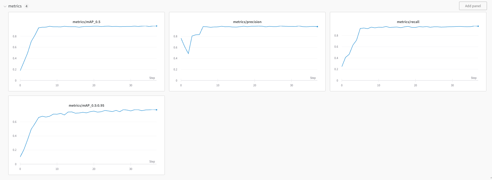

# Automatic Detection of Mosquito Breeding Grounds

This project aims to detect mosquito breeding grounds using YOLOv5 with a Transformer Prediction Head (Swin Transformer) using pre-trained weights based on VISDRONE dataset. The dataset used consists of a subset of videos 2, 6, 9, and 12 from the [Mosquito Database](https://www02.smt.ufrj.br/~tvdigital/database/mosquito/), which has been pre-processed and augmented.

## Dataset

The dataset used for training consists of 5094 images, which have been resized to from 3840x2160 to 1536x864 and augmented with the following settings:

- Outputs per training example: 2
- Bounding Box Rotation: Between -15° and +15°
- Bounding Box Shear: ±15° Horizontal, ±15° Vertical

The pre-processed dataset is available at [https://universe.roboflow.com/luis-augusto-silva-bq4bv/mosquito-suh0p/dataset/2](https://universe.roboflow.com/luis-augusto-silva-bq4bv/mosquito-suh0p/dataset/2).


## Requirements

To run this project, you will need:

- Python 3.x
- PyTorch
- OpenCV
- YOLOv5


# Install
You can install the required packages by running:

```bash
$ git clone https://github.com/luisaugustos/
$ cd yolov5
$ pip install -r requirements.txt
```


## Usage

To use the pre-trained model for mosquito breeding ground detection, you can run the following command:
python detect.py --source video10.avi --weights yolov5l_mosquito.pt

# Train
train.py allows you to train new model from strach.
```bash
$ train.py --img 1536 --adam --batch 4 --epochs 200 --data mosquito-2/data.yaml --weights yolov5l.pt --hy data/hyps/hyp.VisDrone.yaml --cfg models/yolov5l-mosquito-plus.yaml --name v5l-mosquito-plus_luis
``` 



# Description of the Algorithm
...

## Acknowledgements

This project was inspired by the [Mosquito Database](https://www02.smt.ufrj.br/~tvdigital/database/mosquito/) and built on top of the [YOLOv5](https://github.com/ultralytics/yolov5) implementation.

## References
Thanks to their great works
* [ultralytics/yolov5](https://github.com/ultralytics/yolov5)
* [SwinTransformer](https://github.com/microsoft/Swin-Transformer)
* [VisDrone] (https://github.com/VisDrone/VisDrone-Dataset)